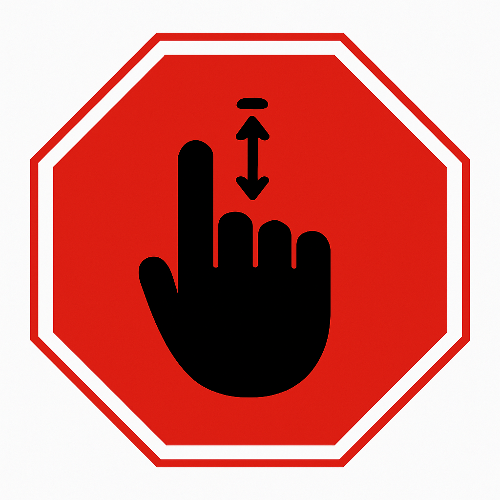
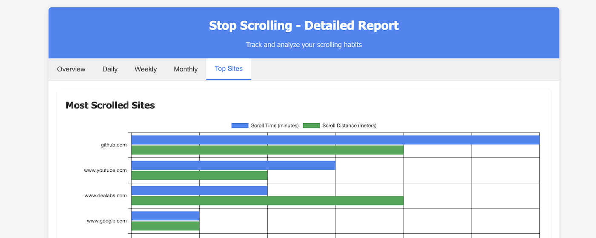
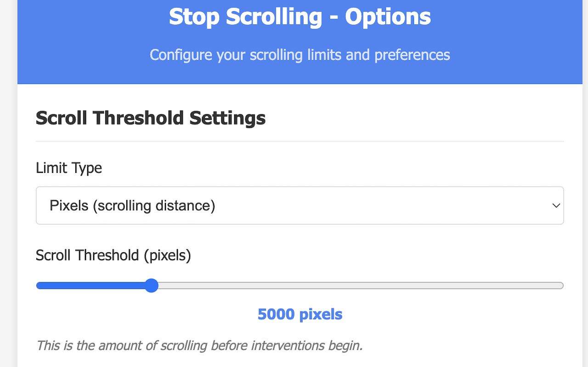

# Stop Scrolling 

 

**Stop Scrolling** is a free Chrome extension designed to help you manage your scrolling habits, take mindful breaks, and reduce time spent on targeted websites. Set thresholds by pixels, meters, or time, schedule restrictions, and get notifications to stay in control of your online activity.

## Features

### 🛑 Scroll Limit Enforcement
Set limits on your scrolling activity:
- Limit scrolling by **pixels**, **meters**, **time**, or a combination.
- Receive visual and sound notifications when thresholds are reached.

### ⏰ Time-Based Restrictions
Control when you can scroll:
- Restrict access to scrolling during certain hours.
- Set **start** (`afterHour`) and **end** (`beforeHour`) times.
- Apply restriction levels to adjust severity of limits.

### 🌐 Targeted Sites
Focus on specific websites:
- Add domains you want to monitor (e.g., `youtube.com`, `twitter.com`).
- Block scrolling only on these sites, leaving others unrestricted.

### 🔔 Notifications
Stay informed with:
- **Sound alerts** when thresholds are exceeded.
- **Visual alerts** on the page to remind you to take a break.

### 🎨 Appearance Settings
Customize your experience:
- Dark mode support and option to follow your system theme.
- Multilingual support with automatic detection or manual selection.

### ⚙️ Adjustable Multipliers
Configure the intensity of restrictions:
- Three levels of multipliers to adjust how strictly scrolling is limited.

### 📊 Reporting & Statistics
Track your scrolling habits:
- Daily and weekly statistics on scrolling activity.
- View how many pixels, meters, or seconds you scrolled.
- Reset data manually: daily, weekly, or all-time.

## Productivity Benefits

- **Improve focus**: Reduce time wasted on distracting websites.
- **Encourage mindful breaks**: Get alerts when scrolling limits are reached.
- **Customize experience**: Target specific sites and schedule restrictions.
- **Enhance digital wellbeing**: Track your habits and adjust limits gradually.

## Installation

1. Download the extension from the **Chrome Web Store**.
2. Click **Add to Chrome** to install.
3. The extension activates automatically and monitors scrolling on configured sites.

## Usage

After installation:
- Open the **Options** page to configure:
    - Scroll thresholds (pixels, meters, time)
    - Time restrictions (`afterHour` / `beforeHour`)
    - Targeted sites for monitoring
    - Notification preferences
    - Appearance settings (dark mode, language)
    - **Reporting & statistics**: view scroll history and reset data
- When a scroll limit is reached or a time restriction is active, scrolling is blocked and a notification is displayed.

## Language Support

Stop Scrolling is available in multiple languages:
- English
- Français (French)
- Deutsch (German)
- Español (Spanish)
- Italiano (Italian)
- 日本語 (Japanese)
- 简体中文 (Simplified Chinese)
- 繁體中文 (Traditional Chinese)
- العربية (Arabic)
- हिन्दी (Hindi)
- Português (Portuguese)
- Русский (Russian)

The extension automatically uses your browser's language, or you can set your preferred language in the options.

## Privacy

Stop Scrolling respects your privacy:
- No data collection or tracking
- No ads or monetization
- Minimal permissions (only accesses targeted sites and Chrome storage)
- All functionality works locally in your browser

## Permissions

### 🔒 Host Permissions
- `<all_urls>`: Required to monitor scrolling on any site you choose.

### 🔑 Extension Permissions
- **Storage**: Save user preferences, scroll statistics, and options.
- **Tabs**: Refresh extension pages after settings changes.
- **Alarms**: Manage time-based restrictions.
- **Notifications**: Display alerts when scrolling is limited.

All permissions are used solely to provide the extension’s core functionality. No data is collected or shared externally.

## Open Source

This extension is open source and free to use. Contributions are welcome!

## Support

If you encounter any issues or have suggestions for improvements, open an issue on the GitHub repository.

---

Enhance your browsing habits today with **Stop Scrolling** – take mindful breaks and regain control of your scrolling behavior!
